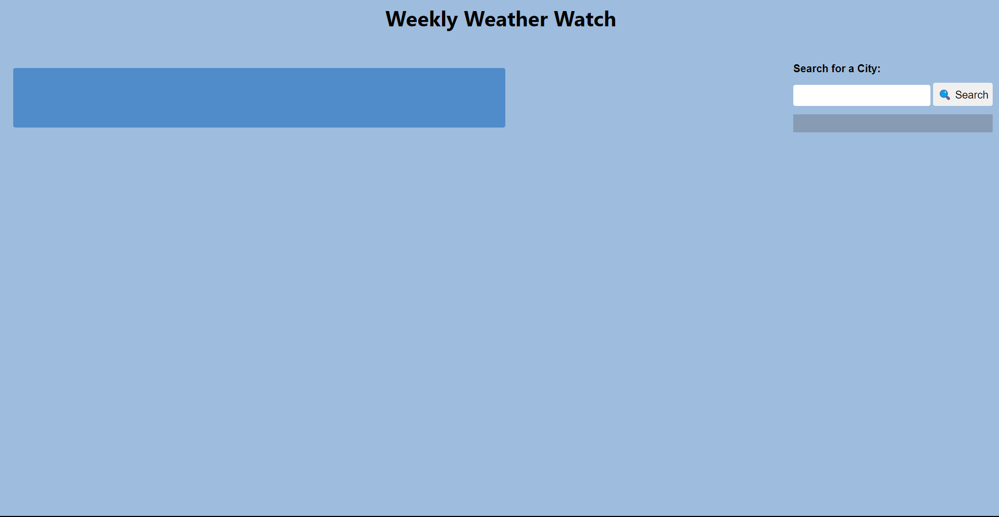
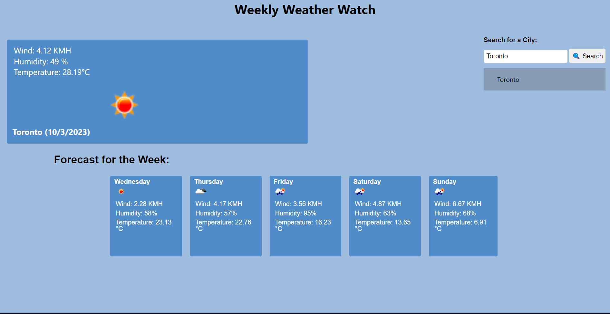
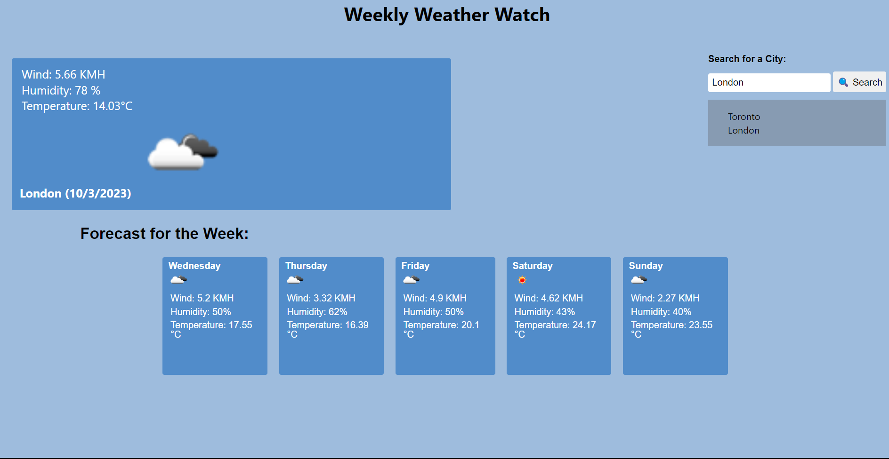
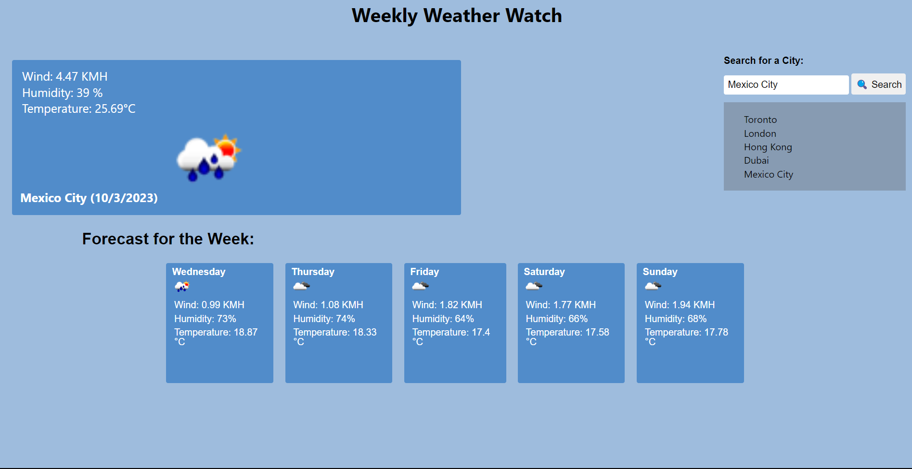

# 06-Weather-App

This appllication is a weather app that allows you to search for a city anywhere around the world and view not only for the weather for the current day including temperature, conditions, humidity, and wind speeds, but also the forecast for the next five days.

This app uses a server-side API from [OpenWeather](https://openweathermap.org/) which is listed in the credit below.

Use my weather app [here.](https://abi-gail17.github.io/06-Weather-App/)

## Table of Contents
[Screenshots](#screenshots-of-application)
[Credit](#credit)
[Installation](#installation)
[License](#license)

## Screenshots of Application

## Credit

Weather API from [OpenWeatherAPI](https://openweathermap.org/forecast5#geo5)

## Installation

N/A

## License

License in repo